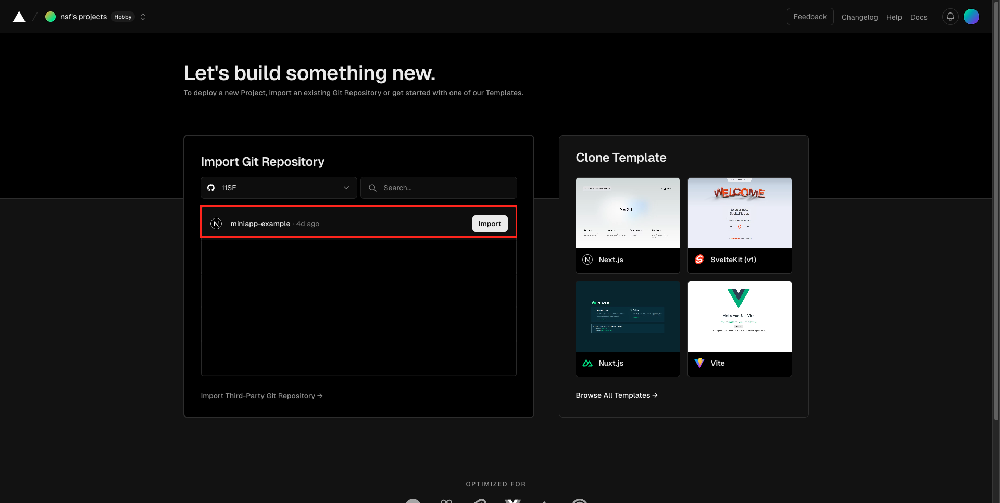

# Mini App Example Project

## Getting Started

This project is a Mini App Example project based on [Next.js](https://nextjs.org/) and styled with [Tailwind CSS](https://tailwindcss.com/).

### Prerequisites

Before running the Mini App Example, make sure you have the following software installed:

- [Node.js](https://nodejs.org/)
- Choose one of the following package managers: [npm](https://www.npmjs.com/), [yarn](https://yarnpkg.com/), [pnpm](https://pnpm.io/), or [bun](https://bun.sh/)

### Setting Up the Development Environment

1. **Clone the example Repository**

   ```bash
   git clone https://github.com/paotang-miniapp/miniapp-example
   cd miniapp-example
   ```

2. **Install Dependencies**

   ```bash
   npm install
   # or
   yarn
   # or
   pnpm install
   # or
   bun install
   ```

3. **Run the Mini App Example**

   ```bash
   npm run dev
   # or
   yarn dev
   # or
   pnpm dev
   # or
   bun dev
   ```

4. **Open Your Browser**

   Open [http://localhost:3000](http://localhost:3000) to see the result.

### Using Ngrok with Your Mini App

During development, if you need to debug your application within the Mini App webview, you can use Ngrok to make your local server accessible over the internet. This enables real-time testing and debugging of your Mini App.

#### Step-by-Step Guide

1. **Run the Mini App Example**

   Start the development server:

   ```bash
   npm run dev
   # or
   yarn dev
   # or
   pnpm dev
   # or
   bun dev
   ```

2. **Expose Your Local Server with Ngrok**

   Open a new terminal window and run Ngrok to expose your local server:

   ```bash
   ngrok http 3000
   ```

   Ngrok will provide you with a public URL that tunnels to your local server. This URL can be used to access your Mini App from any device.

   > **Note:** If you haven't installed Ngrok yet, please refer to the [Ngrok documentation](https://ngrok.com/docs) for installation instructions.

3. **Update Your Mini App Configuration**

   - **Mini App Redirect URL:** Update the Mini App Redirect URL in the Mini App Portal with the public URL provided by Ngrok.
   - **Paotang Pass Callback URL:** Include the Ngrok URL as the callback URL in your Paotang Pass clientId configuration.

By following these steps, you can effectively test your Mini App in a real-time environment, ensuring that it works as expected when deployed.

### Mini App JSBridge

#### Setting Up JSBridge

Before using JSBridge functions, you need to set up JSBridge in your Mini App project with a few essential steps.

1. **Declare Window Type (***TypeScript Only***)**

   In your Mini App project, declare the `window` type in the `index.d.ts` file:

   ```typescript
   interface Window {
      JSBridge: any;
      webkit: any;
      bridge: any;
   }
   ```

2. **Initialize Bridge Object**

   Create a global `bridge` object in your Mini App project to store callback functions for JSBridge operations:

   ```typescript
   window.bridge = {
      initAuthCallback: null,
      initAuthCallbackError: null,
      // Add more callback functions as needed
   };
   ```

   **Note:** Ensure that `window.bridge` is initialized before calling any JSBridge functions.

#### Using JSBridge Functions

We have prepared the core functions for calling `initAuth` in the [JSBridge Specifications](https://ktbinnovation.atlassian.net/wiki/spaces/MA/pages/3498704972/JSBridge+Specifications#initAuth). You can use these functions to integrate the JSBridge into your Mini App project.

```typescript
const initAuth = (
  callback: (authorizationCode: string) => void,
  callbackError: (errorCode: string, errorDescription: string) => void
) => {
  if (window.JSBridge) {
    // For Android
    window.bridge.initAuthCallback = callback;
    window.bridge.initAuthCallbackError = callbackError;
    window.JSBridge.initAuth?.();
  } else if (window.webkit) {
    // For iOS
    window.bridge.initAuthCallback = callback;
    window.bridge.initAuthCallbackError = callbackError;
    const message = { name: "initAuth" };
    window.webkit.messageHandlers.observer.postMessage(message);
  }
};

export default initAuth;
```

Usage:

```typescript
initAuth(
  // Callback function for success
  (authorizationCode: string) => {
    /*
      Logic to handle the authorization code received from the native app
      after successful authentication
    */
  },
  // Callback function for error
  (errorCode, errorDescription) => {
    /*
      Logic to handle the error received from the native app 
      after failed authentication
    */
  }
);
```

In this example project, we demonstrate how to use `initAuth` for user authentication before accessing the app. We have created an `/init` page to handle the various logic for initializing authentication before entering the main app page.

Therefore, we need to set the Mini App Redirect URL to `https://<app-domain>/init` so that the Mini App webview opens this page first (which you might implement as a loading screen or splash screen).

Once the `initAuth` process is successful, the system will redirect the user to the main page of the application with the `authorizationCode` received from `initAuth`.

### Easy Way to Deploy Your Mini App to Vercel

Deploying your Mini App to Vercel is simple and quick. Just follow these steps:

1. **Login to Vercel**
   - Visit [Vercel](https://vercel.com/) and log in to your account.

   

2. **Add a New Project**
   - Click on the "Add New" button.
   - Then click on the "Project" button to start a new project.

   

3. **Select Your Repository**
   - Choose the repository. You can select from GitHub, GitLab, or Bitbucket.
   - Click on "Import" to proceed.

   

4. **Configure Your Project**
   - Verify and configure your project settings.
   - Ensure all the settings are correct, then click "Deploy" to initiate the deployment.

   

5. **View Your Deployed Mini App**
   - After deployment, click on the provided preview URL to view your live Mini App.

   

By following these steps, you can easily deploy your Mini App to Vercel and make it accessible to users.

For more detailed information on deploying projects to Vercel, visit the [Vercel Documentation](https://vercel.com/docs).
