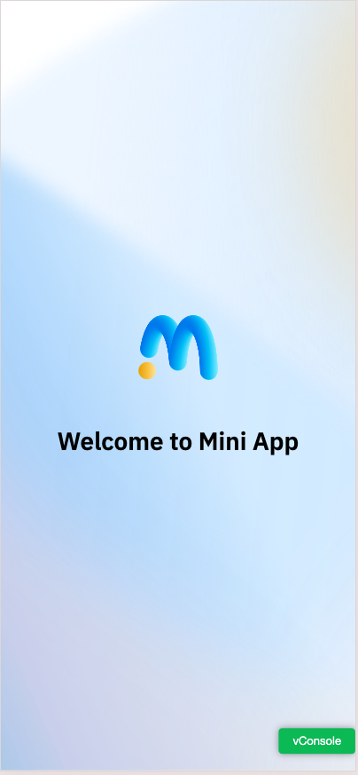
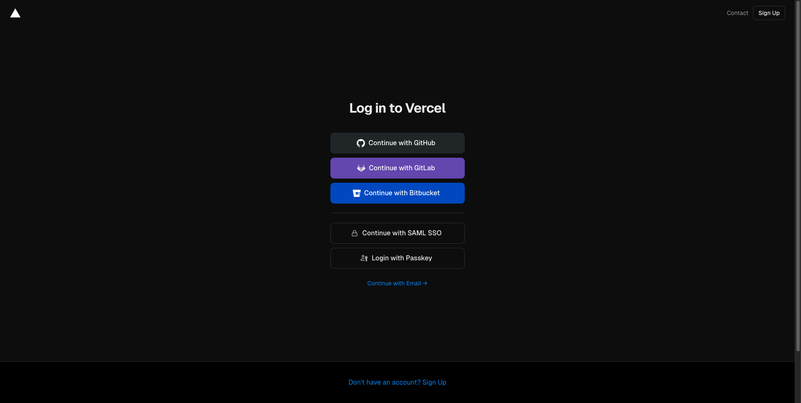
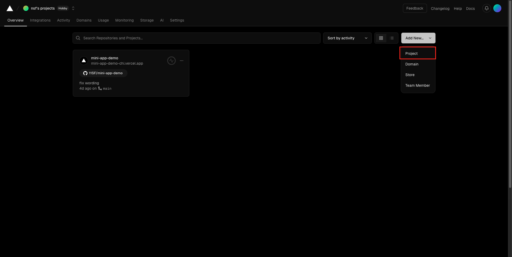
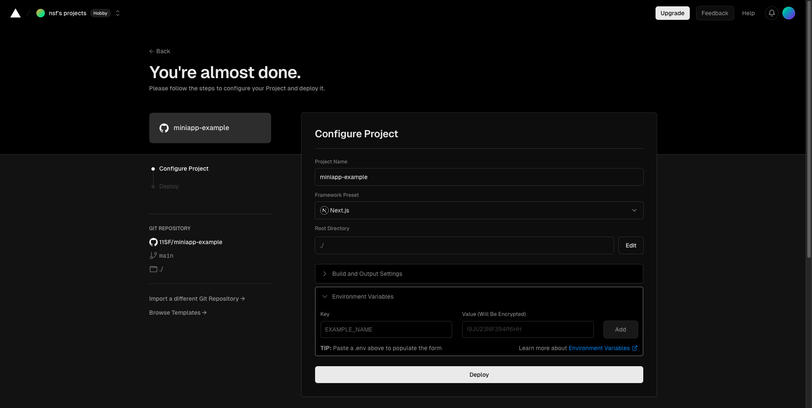
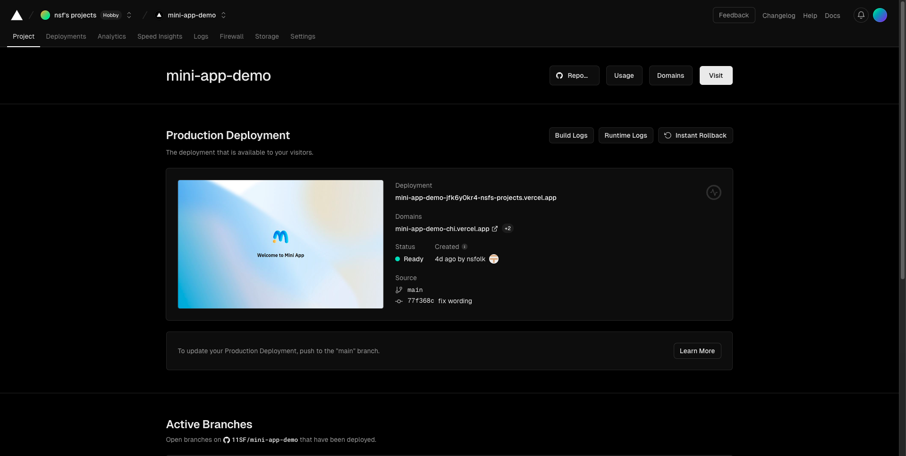

# Mini App Example Project

## Getting Started

The Mini App Example project is a sample project built using [Next.js](https://nextjs.org/) and [Tailwind CSS](https://tailwindcss.com/) to create a web interface.

### Prerequisites

Before running the Mini App Example, make sure you have the following software installed:

- [Git](https://git-scm.com/)
- [Node.js](https://nodejs.org/)
- [npm](https://www.npmjs.com/)
- Text editor or IDE (e.g., [Visual Studio Code](https://code.visualstudio.com/))

Also, ensure your environment is properly configured.

### Setting Up the Development Environment

1. **Prepare Repository**

   1.1. Fork the repository to your GitHub account.

   1.2. Clone the repository to your local machine.

   1.3. Change the directory to the project folder.

2. **Install Dependencies**

   ```bash
   npm install
   ```

3. **Run the Mini App Example**

   ```bash
   npm run dev
   ```

4. **View Your Application**

   Visit [http://localhost:3000](http://localhost:3000) to view your application.

   

5. **Deploy First Mini App**

   Deploying your Mini App to Vercel is simple and quick. Just follow these steps:

   5.1. **Login to Vercel**
      - Visit [Vercel](https://vercel.com/) and log in to your account.

      

   5.2. **Add a New Project**
      - Click on the "Add New" button.
      - Then click on the "Project" button to start a new project.

      

   5.3. **Select Your Repository**
      - Choose the repository. You can select from GitHub, GitLab, or Bitbucket.
      - Click on "Import" to proceed.

      

   5.4. **Configure Your Project**
      - Verify and configure your project settings.
      - Ensure all the settings are correct, then click "Deploy" to initiate the deployment.

      

   5.5. **View Your Deployed Mini App**
      - After deployment, click on the provided "Domains" URL to view your app.

      

   By following these steps, you can easily deploy your Mini App to Vercel and make it accessible to users. For more detailed information on deploying projects to Vercel, visit the [Vercel Documentation](https://vercel.com/docs).

After you have completed the steps above,  proceed to the next step at [Step 3: Register Your Application to the MiniApp Portal](https://ktbinnovation.atlassian.net/wiki/spaces/MA/pages/3832611660/1st+Mini+App+Hello+World#Step-3%3A-Register-Your-Application-to-the-MiniApp-Portal)

----

### About Project Structure

This project is divided into two main parts: Frontend and Backend.

1. The Frontend is located in the `src/app` folder (excluding `src/app/api`).
2. The Backend is located in the `src/app/api` folder, which includes examples of API usage.

### Starting to Develop

To begin developing your Mini App, go to the `src/app` folder and start modifying the files within it. We suggest starting with the `src/app/page.tsx` file, as it serves as the main page for your Mini App. This file includes examples of basic functions such as authentication and payment, allowing you to kickstart your development right away.

### Integrate with OAPI Services using Provided Functions

In this project, we have prepared functions for working with OAPI Services. These functions are located in the `src/lib/frontend/index.ts` file and we create a example usage in `src/app/page.tsx` file.

#### Authentication service

##### Prerequisites for using the authentication service

Setup the environment variables in the `.env` file:

```bash
   NEXT_PUBLIC_THREE_LEGGED_CLIENT_ID=<3-legged-client-id>        # 3 legged client id value from OAPI Portal. Use for initAuth via jsbridge. it must be the same as the `THREE_LEGGED_CLIENT_ID` in backend config
   NEXT_PUBLIC_AUTHENTICATION_SCOPE=openid+offline                # authentication scope value from OAPI Portal. Use for initAuth via jsbridge. it must be the same as the `AUTHENTICATION_SCOPE` in backend config

   THREE_LEGGED_CLIENT_ID=<3-legged-client-id>                    # 3 legged client id value from OAPI Portal
   THREE_LEGGED_SECRET_KEY=<3-legged-client-secret>               # 3 legged secret key value from OAPI Portal
   ENDPOINT_EXCHANGE_TOKEN=https://oapi.service/exchange          # OAPI Service endpoint for exchange token
   ENDPOINT_GET_CUSTOMER_PROFILE=https://oapi.service/customer    # OAPI Service endpoint for get customer profile
   AUTHENTICATION_SCOPE=openid+offline                            # authentication scope from OAPI Portal sparated by '+', example: openid+offline
   AUTHENTICATION_REDIRECT_URL=https://your.miniapp               # redirect url. it must be the same as the authentication redirect url in OAPI Portal and default destination url in miniapp Portal
```

1. `initAuth` - Calls jsbridge `initAuth` with clientId and scope values from environment variables, and sends an API request to OAPI Services to exchange the token.
2. `getCustomerProfile` - Retrieves the customer profile using the access token obtained from the token exchange with PT Pass.

#### Payment service

##### Prerequisites for using the payment service

Setup the environment variables in the `.env` file:

```bash
   MINIAPP_UUID=<uuid>                                                     # App ID value from the MiniApp Portal in the Application Details section.
   TWO_LEGGED_CLIENT_ID=<2-legged-client-id>                               # 2 legged client id value from OAPI Portal
   TWO_LEGGED_SECRET_KEY=<2-legged-client-secret>                          # 2 legged secret key value from OAPI Portal
   ENDPOINT_PAYMENT_GET_TOKEN=https://oapi.service/oauth/token             # OAPI Service endpoint for get 2 legged token        
   ENDPOINT_PAYMENT_DEEPLINK=https://oapi.service/deeplink                 # OAPI Service endpoint for get payment deeplink
   ENDPOINT_PAYMENT_INQUIRY_TRANSACTION=https://oapi.service/inquiry   # OAPI Service endpoint for inquiry transaction
   PAYMENT_TXN_CONFIG_COMP_CODE=00000                                      # company code value from OAPI Portal in merchant configuration
   PAYMENT_TXN_CONFIG_DEEPLINK_URL=https://your.miniapp/result             # deeplink url for return to app after payment completed
```

##### Payment service functions

1. `initPayment` - Get access token and initialize payment transaction and opens the payment flow for completing the transaction.
2. `inquiryPaymentTransaction` - Get access token and inquiry the transaction status using the txnRefId

These functions will invoke the APIs within this project, located in the `src/app/api` folder. Examples of API usage are provided and can be modified as needed. Additionally, we provide backend functions for integrating with OAPI services in the `src/lib/backend` folder, You can use these functions with your own services.
